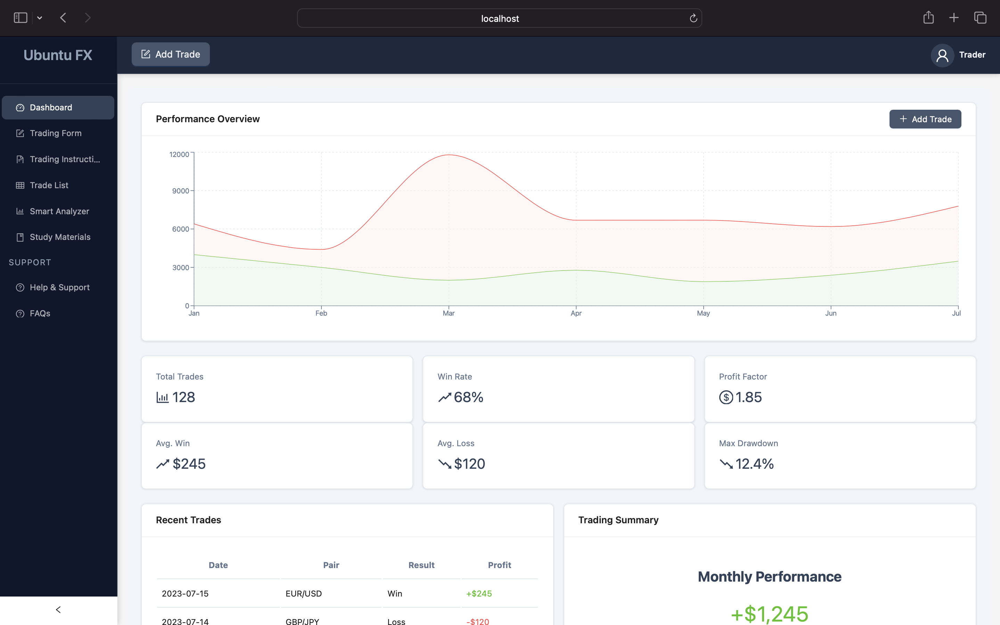
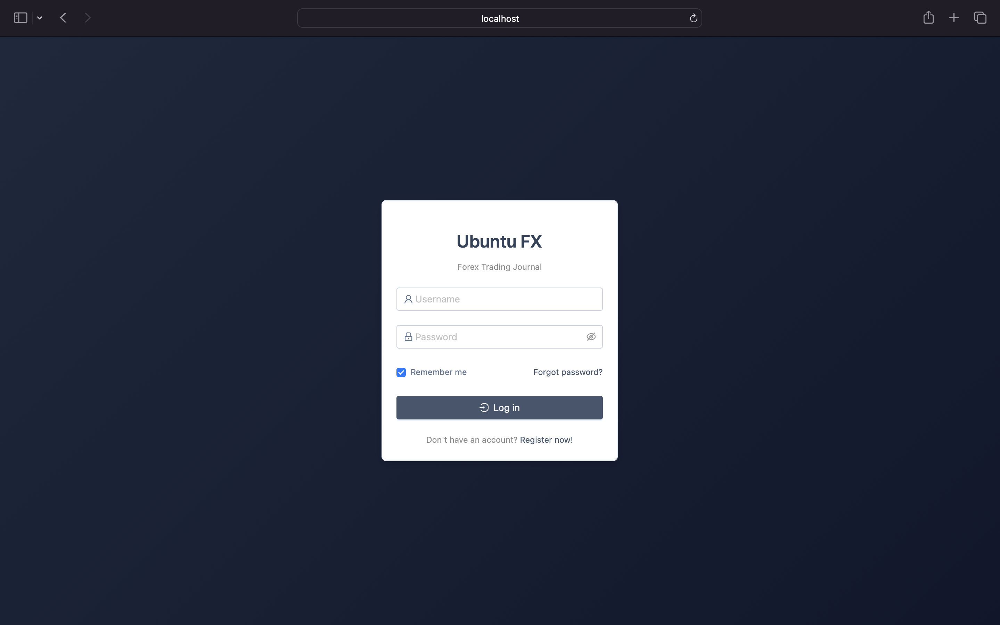
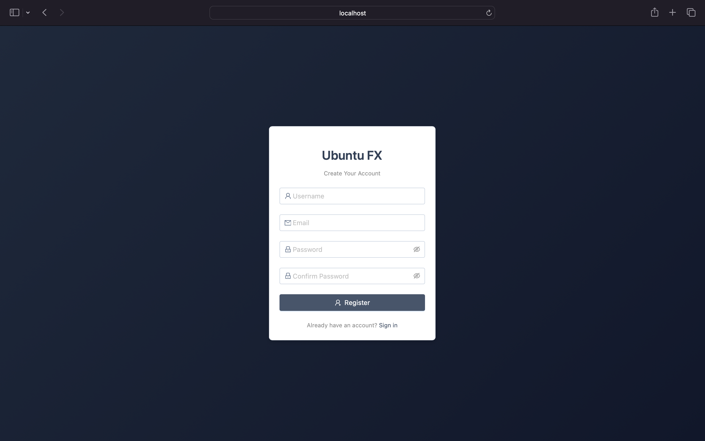
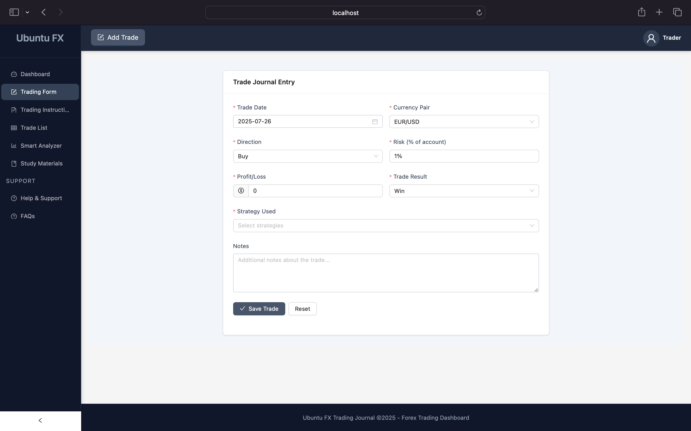
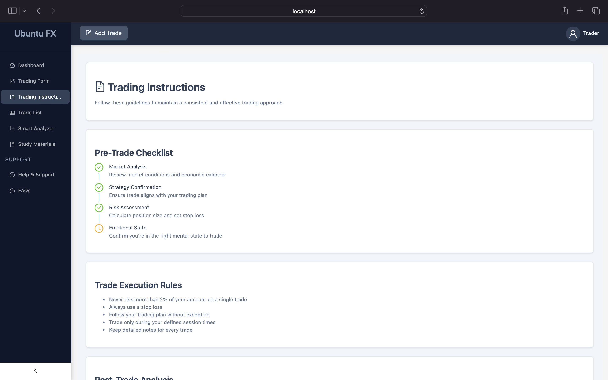
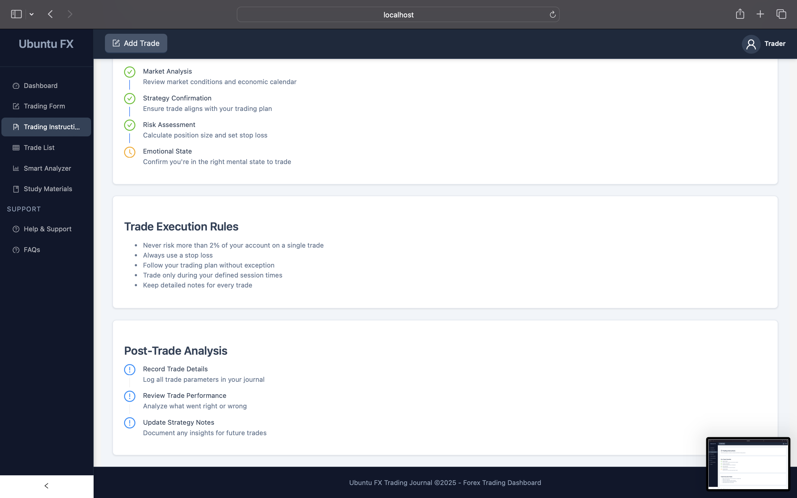

# Ubuntu FX Trading Journal Dashboard

A comprehensive Forex trading journal and analytics dashboard built with React, TypeScript, and Ant Design.

## 📊 Overview

Ubuntu FX is a professional trading journal application designed for Forex traders to track, analyze, and optimize their trading performance. The dashboard provides powerful tools for recording trades, analyzing performance metrics, and improving trading strategies.

## 🚀 Features

### Core Functionality

- **Trade Journal**: Record and manage all trading activities
- **Performance Analytics**: Visualize profit/loss trends and key metrics
- **Smart Analyzer**: AI-powered trade evaluation system
- **Trading Instructions**: Guided trading workflow and best practices
- **Trade History**: Comprehensive trade listing with filtering and search

### User Management

- **Profile Management**: Personal information and preferences
- **Settings Configuration**: Application customization
- **Authentication**: Secure login and registration system
- **Achievements System**: Track trading milestones

### Educational Resources

- **Learning Materials**: Developer resources and trading guides
- **MQL5 Scripts**: Ready-to-use trading robots and indicators
- **Video Tutorials**: Step-by-step learning content

### Technical Features

- **Responsive Design**: Works on desktop and tablet devices
- **Dark Theme**: Custom slate color scheme for reduced eye strain
- **Data Visualization**: Interactive charts with Recharts
- **Smooth Animations**: Framer Motion powered transitions

## 🛠️ Tech Stack

### Frontend

- **React 18** with TypeScript
- **Vite** for fast development
- **Ant Design 5** for UI components
- **Recharts** for data visualization
- **Framer Motion** for animations
- **React Router** for navigation

### Development Tools

- **ESLint** for code quality
- **TypeScript** for type safety
- **Jest** for testing (planned)

## 📁 Project Structure

```
ubuntu-fx-dashboard/
├── public/
│   ├── favicon.ico
│   └── index.html
├── src/
│   ├── assets/
│   ├── components/
│   │   ├── charts/
│   │   ├── forms/
│   │   ├── layout/
│   │   └── tables/
│   ├── pages/
│   │   ├── auth/
│   │   │   ├── Login.tsx
│   │   │   ├── Register.tsx
│   │   │   └── PasswordRecovery.tsx
│   │   ├── Dashboard.tsx
│   │   ├── TradingForm.tsx
│   │   ├── TradingInstructions.tsx
│   │   ├── TradeList.tsx
│   │   ├── SmartAnalyzer.tsx
│   │   ├── Profile.tsx
│   │   ├── Settings.tsx
│   │   ├── Materials.tsx
│   │   ├── HelpSupport.tsx
│   │   └── FAQs.tsx
│   ├── styles/
│   │   ├── global.css
│   │   └── variables.css
│   ├── types/
│   │   └── index.ts
│   ├── utils/
│   │   └── constants.ts
│   ├── App.tsx
│   └── main.tsx
├── .gitignore
├── index.html
├── package.json
├── tsconfig.json
├── tsconfig.node.json
├── vite.config.ts
└── README.md
```

## 🚀 Getting Started

### Prerequisites

- Node.js (v16 or higher)
- npm or yarn

### Installation

1. Clone the repository:

```bash
git clone https://github.com/yourusername/ubuntu-fx-dashboard.git
cd ubuntu-fx-dashboard
```

2. Install dependencies:

```bash
npm install
```

3. Start the development server:

```bash
npm run dev
```

4. Build for production:

```bash
npm run build
```

5. Preview production build:

```bash
npm run preview
```

## 🎨 Color Theme

The dashboard uses a custom slate color palette:

| Color | Hex | Usage |
|-------|-----|-------|
| Slate 50 | `#f8fafc` | Backgrounds, cards |
| Slate 100 | `#f1f5f9` | Content backgrounds |
| Slate 200 | `#e2e8f0` | Borders, dividers |
| Slate 300 | `#cad5e2` | Disabled states |
| Slate 400 | `#90a1b9` | Secondary text |
| Slate 500 | `#62748e` | Labels, descriptions |
| Slate 600 | `#45556c` | Primary buttons |
| Slate 700 | `#314158` | Headers, text |
| Slate 800 | `#1d293d` | Navigation, headers |
| Slate 900 | `#0f172b` | Main background |

## 📱 Responsive Design

The dashboard is optimized for:

- Desktop screens (1200px+)
- Tablet devices (768px+)
- Mobile devices (responsive layout)

## 🔧 Development

### Available Scripts

- `npm run dev` - Start development server
- `npm run build` - Build for production
- `npm run preview` - Preview production build
- `npm run lint` - Run ESLint
- `npm run lint:fix` - Fix ESLint issues

### Adding New Pages

1. Create a new component in `src/pages/`
2. Add the route in `App.tsx`
3. Add navigation item in the menu configuration

## 🤝 Contributing

1. Fork the repository
2. Create your feature branch (`git checkout -b feature/AmazingFeature`)
3. Commit your changes (`git commit -m 'Add some AmazingFeature'`)
4. Push to the branch (`git push origin feature/AmazingFeature`)
5. Open a pull request

## 📄 License

This project is licensed under the MIT License - see the [LICENSE](LICENSE) file for details.

## 🙏 Acknowledgments

- [Ant Design](https://ant.design/) for UI components
- [Recharts](https://recharts.org/) for data visualization
- [Framer Motion](https://www.framer.com/motion/) for animations
- [Vite](https://vitejs.dev/) for build tooling

## 📞 Support

For support, please open an issue on GitHub or contact the development team.

---

## DEMO Images












